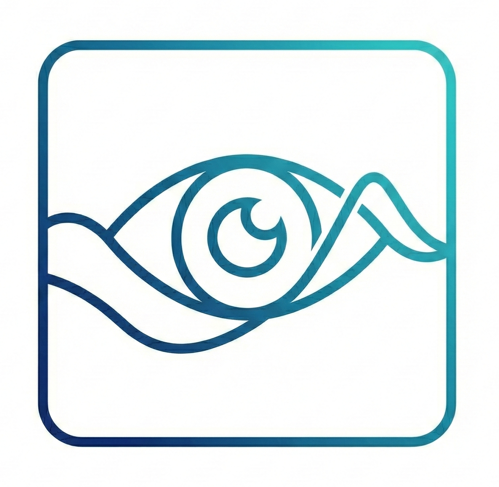
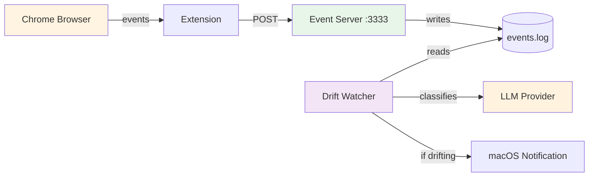

<div align="center">



# Drift Watcher

A personal focus monitoring system that tracks browser activity and detects when you drift from your goals

[](https://www.python.org/downloads/)
[](https://www.apple.com/macos/)
[](https://www.google.com/chrome/)
[](LICENSE)

[Features](#-features) • [Quick Start](#-quick-start) • [Installation](#-installation) • [Usage](#-usage) • [Configuration](#-configuration)

> **⚠️ Platform Support:** Currently supports **macOS** and **Google Chrome** only. Windows/Linux and other browsers coming soon!

</div>

---

## ✨ Features

- 🤖 **AWS Bedrock LLM** - Powered by Claude 3.5 Sonnet
- 🔌 **Extensible** - Easy to add custom LLM providers
- 📊 **Activity Classification** - Automatic categorization of browser activity
- 📄 **Content-Aware** - Uses page titles, URLs, and content for accurate classification
- 🎯 **Focus State Detection** - ALIGNED, EXPLORING, or DRIFTING states
- 🔔 **Smart Notifications** - macOS notifications when you drift from goals
- 🔌 **Chrome Extension** - Seamless browser activity tracking
- 🗑️ **Auto Log Management** - Automatic cleanup of old logs

## 🖥️ Platform Support

| Platform | Status | Notes |
|----------|--------|-------|
| **macOS** | ✅ Supported | Full support with native notifications |
| **Windows** | 🚧 Coming Soon | Notification system needs adaptation |
| **Linux** | 🚧 Coming Soon | Notification system needs adaptation |

| Browser | Status | Notes |
|---------|--------|-------|
| **Chrome** | ✅ Supported | Full extension support |
| **Edge** | 🚧 Coming Soon | Chromium-based, should work with minor changes |
| **Firefox** | 🚧 Coming Soon | Requires Manifest V2 version |
| **Safari** | 🚧 Coming Soon | Requires Safari extension conversion |

## 🚀 Quick Start

### System-Wide Installation (Recommended)

```bash
# 1. Clone and install
git clone https://github.com/yourusername/drift-watcher.git
cd drift-watcher

# 2. Install dependencies
pip install -r requirements.txt

# 3. Install the package
pip install --no-build-isolation --no-deps .

# 4. Run with your goal (server auto-starts!)
drift-watcher --goal "Learn Python programming"

# Press Ctrl+C to stop
```

### Development Mode

```bash
# 1. Install dependencies
pip install -r requirements.txt

# 2. Start the event server
drift-watcher-server

# 3. In another terminal, run the agent
drift-watcher --goal "Learn Python programming"
```

That's it! The agent will monitor your browser activity and notify you if you drift.

---

## 📦 Installation

### System-Wide Installation (Recommended)

Install Drift Watcher globally on your system:

```bash
# Clone the repository
git clone https://github.com/yourusername/drift-watcher.git
cd drift-watcher

# Install with pip
pip install .
```

After installation, you can run commands from anywhere:

```bash
drift-watcher --goal "Your goal"
drift-watcher-server
drift-watcher-goal
drift-watcher-switch ollama
```

All data is stored in `~/.drift-watcher/`

See [docs/INSTALL.md](docs/INSTALL.md) for detailed installation instructions.

### Development Mode

For development or if you prefer not to install system-wide:

### Prerequisites

- **Operating System:** macOS (Monterey or later recommended)
- **Browser:** Google Chrome
- **Python:** 3.8 or higher
- **AWS Account:** For Bedrock access with Claude 3.5 Sonnet

> **Note:** Windows and Linux support is planned. Other Chromium-based browsers (Edge, Brave) may work but are untested.
> 
> **Notification Icons:** macOS notifications will show the Terminal icon due to system limitations. Custom icons require a proper .app bundle.

### Step 1: Clone and Install Dependencies

**For system-wide installation:**

```bash
git clone https://github.com/yourusername/drift-watcher.git
cd drift-watcher
pip install -r requirements.txt
pip install --no-build-isolation --no-deps .
```

**For development:**

```bash
# Clone the repository
git clone https://github.com/yourusername/drift-watcher.git
cd drift-watcher

# Install Python dependencies
pip install -r requirements.txt
```

### Step 2: Install Chrome Extension

1. Open Google Chrome and navigate to `chrome://extensions/`

2. Enable **Developer mode** (toggle in the top-right corner)

3. Click **"Load unpacked"**

4. Navigate to and select the `drift-watcher-chrome-extension/` directory in this project

5. The extension should now appear in your extensions list with the name "Drift Watcher"

That's it! The extension will automatically start tracking your browser activity.

### Step 3: Configure AWS Credentials (for Bedrock)

If you're using AWS Bedrock (default provider), configure your AWS credentials:

#### Option A: AWS CLI Configuration (Recommended)

```bash
# Install AWS CLI if not already installed
pip install awscli

# Configure credentials
aws configure
```

You'll be prompted for:
- **AWS Access Key ID**: Your AWS access key
- **AWS Secret Access Key**: Your AWS secret key
- **Default region name**: `us-east-1` (or your preferred region)
- **Default output format**: `json`

#### Option B: Environment Variables

```bash
export AWS_ACCESS_KEY_ID="your-access-key"
export AWS_SECRET_ACCESS_KEY="your-secret-key"
export AWS_DEFAULT_REGION="us-east-1"
```

#### Option C: AWS Credentials File

Create or edit `~/.aws/credentials`:

```ini
[default]
aws_access_key_id = your-access-key
aws_secret_access_key = your-secret-key
```

And `~/.aws/config`:

```ini
[default]
region = us-east-1
```

#### Verify AWS Configuration

```bash
# Test AWS credentials
aws sts get-caller-identity

# Should return your AWS account information
```

> **Important:** Ensure your AWS account has access to Amazon Bedrock and the Claude model. You may need to request model access in the AWS Bedrock console.---

## 🎯 Usage

### Running Drift Watcher

#### System-Wide Installation

```bash
# Run with a goal (server auto-starts!)
drift-watcher --goal "Learn Python programming"

# Press Ctrl+C to stop
# You'll be asked if you want to stop the server too

# Or use existing goal
drift-watcher

# Manual server control (if needed)
drift-watcher-server              # Start server manually
drift-watcher --no-server         # Don't auto-start server
```

#### Development Mode

```bash
# 1. Start the event server
python run_server.py

# 2. In another terminal
python main.py --goal "Learn Python programming"
```

You should see:
```
🌐 Starting event server...
✅ Event server started
✅ Event server already running

💡 Press Ctrl+C to stop Drift Watcher

🧠 Drift Watcher started
📋 Config: bedrock | Window: 30s
🤖 LLM: AWS Bedrock (anthropic.claude-3-5-sonnet-20240620-v1:0)
🎯 Goal: Learn Python programming
```

**What Drift Watcher Does:**
- Auto-starts event server if not running
- Monitors your browser activity every 30 seconds
- Classifies your activities (IMPLEMENTATION, DEBUGGING, BROWSING, etc.)
- Assesses if you're ALIGNED, EXPLORING, or DRIFTING
- Sends macOS notifications when you drift from your goal
- Asks if you want to stop the server when you quit

### Managing Your Goal

#### System-Wide Installation

```bash
# View current goal
drift-watcher-goal

# Set new goal
drift-watcher-goal --set "Build a web application"
```

#### Development Mode

```bash
python manage_goal.py
```

Output:
```
============================================================
Current Focus Goal
============================================================

🎯 Learn Python programming

State: EXPLORING
Confidence: 0.7
============================================================
```

### Switching LLM Providers

#### System-Wide Installation

```bash
# Switch to Ollama (local, free)
drift-watcher-switch ollama

# Switch to OpenAI
drift-watcher-switch openai

# Switch to Anthropic
drift-watcher-switch anthropic

# Switch back to Bedrock
drift-watcher-switch bedrock
```

#### Development Mode

```bash
# Switch to Ollama (local, free)
python switch_provider.py ollama

# Switch to OpenAI
python switch_provider.py openai

# Switch to Anthropic
python switch_provider.py anthropic

# Switch back to Bedrock
python switch_provider.py bedrock
```

**What Drift Watcher Does:**
- Monitors your browser activity every 30 seconds
- Classifies your activities (IMPLEMENTATION, DEBUGGING, BROWSING, etc.)
- Assesses if you're ALIGNED, EXPLORING, or DRIFTING
- Sends macOS notifications when you drift from your goal

---

## ⚙️ Configuration

### Configuration File

The `config.json` file controls all agent settings:

```json
{
  "llm": {
    "provider": "bedrock",
    "config": {
      "model_id": "anthropic.claude-3-5-sonnet-20240620-v1:0",
      "region_name": "us-east-1"
    }
  },
  "agent": {
    "window_seconds": 30,
    "drift_confidence_threshold": 0.7
  },
  "server": {
    "host": "127.0.0.1",
    "port": 3333
  }
}
```

### Configuration Options

| Option | Description | Default |
|--------|-------------|---------|
| `llm.provider` | LLM provider name | `bedrock` |
| `llm.config` | Provider-specific configuration | Varies |
| `agent.window_seconds` | Monitoring interval in seconds | `30` |
| `agent.drift_confidence_threshold` | Confidence threshold for drift alerts | `0.7` |
| `agent.log_retention_days` | Days to keep event logs | `7` |
| `server.host` | Event server host | `127.0.0.1` |
| `server.port` | Event server port | `3333` |

### Log Management

Drift Watcher automatically manages log files to prevent excessive disk usage:

**When you set a new goal:**
- Old event logs are cleared
- Activity cache is reset
- Fresh start for the new goal

**Automatic cleanup:**
- Logs older than 7 days are automatically deleted (configurable)
- Cleanup runs on startup and every ~50 minutes
- Keeps your data directory clean

**Configure retention period:**
```json
{
  "agent": {
    "log_retention_days": 14  // Keep logs for 14 days
  }
}
```

### Provider Configurations

<details>
<summary><b>AWS Bedrock</b></summary>

```json
{
  "llm": {
    "provider": "bedrock",
    "config": {
      "model_id": "anthropic.claude-3-5-sonnet-20240620-v1:0",
      "region_name": "us-east-1"
    }
  }
}
```

</details>

<details>
<summary><b>OpenAI</b></summary>

```json
{
  "llm": {
    "provider": "openai",
    "config": {
      "model": "gpt-4",
      "api_key": "sk-..."
    }
  }
}
```

</details>

<details>
<summary><b>Anthropic</b></summary>

```json
{
  "llm": {
    "provider": "anthropic",
    "config": {
      "model": "claude-3-5-sonnet-20241022",
      "api_key": "sk-ant-..."
    }
  }
}
```

</details>

<details>
<summary><b>Ollama (Local)</b></summary>

```json
{
  "llm": {
    "provider": "ollama",
    "config": {
      "model": "llama3.2",
      "base_url": "http://localhost:11434"
    }
  }
}
```

</details>

---

## � Custom LLM Providers

Drift Watcher uses AWS Bedrock by default, but you can easily add your own LLM provider (OpenAI, Anthropic, Ollama, etc.).

### Creating a Custom Provider

See `examples/custom_provider.py` for a complete example. Here's the basic structure:

```python
from drift_watcher.llm.base import BaseLLMClient
import json

class MyLLMClient(BaseLLMClient):
    def __init__(self, api_key: str, model: str = "gpt-4"):
        self.api_key = api_key
        self.model = model
    
    @property
    def name(self) -> str:
        return f"My Provider ({self.model})"
    
    def invoke(self, prompt: str, max_tokens: int = 200, temperature: float = 0.2) -> dict:
        # Call your LLM API here
        # Must return parsed JSON dict with keys: state, confidence, reason
        response = your_api_call(prompt, max_tokens, temperature)
        return json.loads(response)
```

### Using Your Custom Provider

```python
from drift_watcher.llm import LLMReasoner
from my_provider import MyLLMClient

# Create your client
client = MyLLMClient(api_key="your-key", model="gpt-4")

# Use it with the reasoner
reasoner = LLMReasoner(client=client)
```

The custom provider must return JSON responses matching this format:

```json
{
  "state": "ALIGNED | EXPLORING | DRIFTING",
  "confidence": 0.85,
  "reason": "Brief explanation"
}
```

---

## 📚 Command Reference

### System-Wide Installation

```bash
# Main agent (auto-starts server)
drift-watcher --goal "Your goal"
drift-watcher                      # Use existing goal
drift-watcher --no-server          # Don't auto-start server
drift-watcher --test-notification  # Test notifications

# Manual server control (optional)
drift-watcher-server
drift-watcher-server --host 127.0.0.1 --port 3333

# Goal management
drift-watcher-goal                    # View current goal
drift-watcher-goal --set "New goal"   # Set new goal

# Provider switching
drift-watcher-switch bedrock
drift-watcher-switch openai
drift-watcher-switch anthropic
drift-watcher-switch ollama
```

### Development Mode

```bash
# Agent commands
python main.py --goal "Your focus goal"

# Use existing goal
python main.py

# Custom configuration file
python main.py --config custom.json

# Show help
python main.py --help
```

### Goal Management

```bash
# View current goal
python manage_goal.py

# Set new goal
python manage_goal.py --set "New goal"

# Show help
python manage_goal.py --help
```

### Provider Switching

```bash
# Switch provider
python switch_provider.py <provider>

# Available providers: bedrock, openai, anthropic, ollama
```

### Server

```bash
# Start event server
python run_server.py
```

---

## 🏗️ Architecture

### High-Level Flow



---

## 🔧 Troubleshooting

### Quick Notification Test

```bash
# Test if notifications work
drift-watcher --test-notification
```

<details>
<summary><b>Notifications not appearing</b></summary>

**macOS Notification Settings:**
1. System Settings → Notifications → Terminal
2. Enable "Allow Notifications"
3. Set alert style to "Banners" or "Alerts"
4. Disable "Do Not Disturb" mode

**Check Cooldown:**
- Default cooldown: 5 minutes between notifications
- Check agent output for: `🔕 Notification cooldown: Xs remaining`

**Check Threshold:**
- Default threshold: 0.7 confidence
- Check agent output for: `⚠️ Drifting but confidence too low`
- Lower threshold in `config.json` if needed

**About Notification Icons:**
- macOS notifications will show the Terminal icon (system limitation)
- Custom icons require a proper .app bundle with Info.plist
- This is a macOS security feature that can't be bypassed from Python scripts

> **Note:** Notifications currently only work on macOS. Windows/Linux support coming soon.

See [TROUBLESHOOTING.md](docs/TROUBLESHOOTING.md) for detailed help.

</details>

<details>
<summary><b>Drift Watcher not detecting activity</b></summary>

- Verify Chrome extension is installed and enabled at `chrome://extensions/`
- Check event server is running (`python run_server.py`)
- Ensure extension can reach `http://localhost:3333`
- Check browser console for errors (F12 → Console)
- Try reloading the extension

</details>

<details>
<summary><b>AWS Bedrock errors</b></summary>

- Verify AWS credentials: `aws sts get-caller-identity`
- Check Bedrock model access in AWS Console
- Ensure correct region in `config.json`
- Verify IAM permissions for Bedrock

</details>

<details>
<summary><b>No notifications appearing</b></summary>

- **macOS**: Grant notification permissions to Terminal/iTerm
  - System Preferences → Notifications → Terminal → Allow
- Check drift confidence threshold (default: 0.7)
- Verify notifier cooldown period (default: 5 minutes)

</details>

<details>
<summary><b>Ollama connection errors</b></summary>

- Ensure Ollama is running: `ollama serve`
- Verify model is pulled: `ollama pull llama3.2`
- Check base URL in config: `http://localhost:11434`

</details>

---

## 🤝 Contributing

Contributions are welcome! Here are some ways you can contribute:

- 🐛 Report bugs and issues
- 💡 Suggest new features
- 📝 Improve documentation
- 🔧 Submit pull requests
- 🖥️ **Help port to Windows/Linux**
- 🌐 **Help create Firefox/Edge extensions**

### Priority Areas

We're especially looking for help with:

1. **Windows Support**
   - Adapt notification system for Windows 10/11
   - Test and fix any platform-specific issues

2. **Linux Support**
   - Implement notifications for various Linux desktop environments
   - Test on Ubuntu, Fedora, Arch, etc.

3. **Browser Extensions**
   - Port Chrome extension to Firefox (Manifest V2)
   - Test on Edge and other Chromium browsers
   - Create Safari extension version

### Adding Custom LLM Providers

```python
from src.llm.base import BaseLLMClient
from src.llm import LLMFactory

class MyCustomClient(BaseLLMClient):
    def invoke(self, prompt, max_tokens=200, temperature=0.2):
        # Your implementation
        return {"response": "..."}
    
    @property
    def name(self):
        return "My Custom Provider"

# Register it
LLMFactory.register_provider("custom", MyCustomClient)
```

See `examples/custom_provider.py` for a complete example.

---

## 📄 License

This project is licensed under the MIT License - see the [LICENSE](LICENSE) file for details.