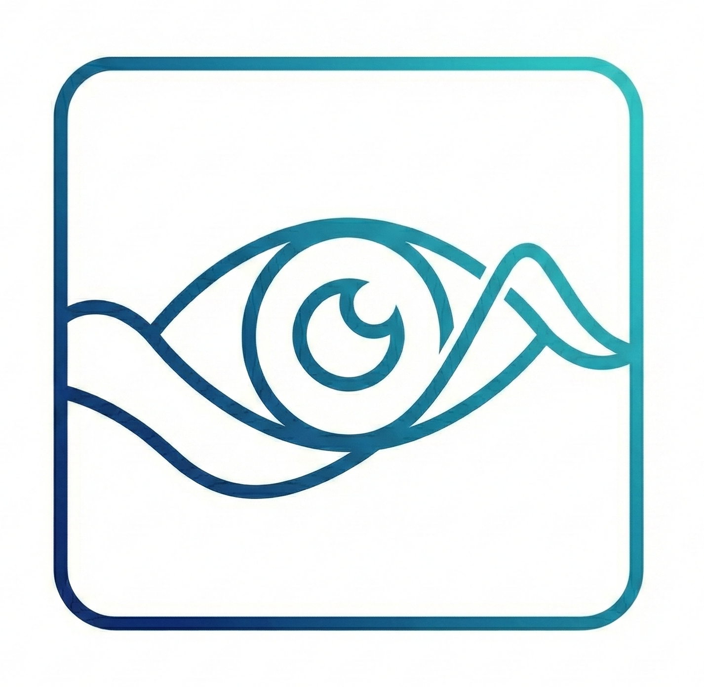

<div align="center">



# Drift Watcher

An intent-aware focus monitor that catches you drifting from your work goal — before your brain fully switches context

[](https://www.python.org/downloads/)
[](https://www.apple.com/macos/)
[](https://www.google.com/chrome/)
[](LICENSE)

[Quick Start](#-quick-start) • [How It Works](#-how-it-works) • [Configuration](#️-configuration) • [Dashboard](#-dashboard) • [Commands](#-command-reference)

> **⚠️ Platform Support:** Currently supports **macOS** and **Google Chrome** only.

</div>

---

DriftWatcher monitors your browser activity and uses an LLM — with access to your real work context via internal MCP tools — to detect when you drift from your current goal. Unlike site blockers, it judges *intent*: the same internal wiki page can be FOCUSED (related to your current task) or DRIFTING (related to a different team's project). The URL alone never tells the full story.

---

## ✨ Features

- 🤖 **Claude CLI default** — uses your existing Claude Code login, no API key needed
- 🔌 **MCP-aware classification** — queries Taskei, wiki, and internal tools to understand your actual assigned work
- 📊 **Intent-based detection** — FOCUSED or DRIFTING based on goal relevance, not URL patterns
- 🎯 **Trend-based alerts** — requires 2 consecutive DRIFTING assessments before notifying, reducing false positives
- 🔔 **Smart notifications** — macOS notifications with the LLM's reason; cooldown persists across restarts
- 📄 **Content-aware** — captures page content, scroll, and keystrokes for accurate engagement scoring
- 🖥️ **Live dashboard** — goal management, activity feed, drift log, session stats, history
- 🗑️ **Auto log management** — automatic cleanup of old events

## 🖥️ Platform Support

| Platform | Status | Notes |
|----------|--------|-------|
| **macOS** | ✅ Supported | Full support with native notifications |
| **Windows** | 🚧 Coming Soon | Notification system needs adaptation |
| **Linux** | 🚧 Coming Soon | Notification system needs adaptation |

| Browser | Status | Notes |
|---------|--------|-------|
| **Chrome** | ✅ Supported | Full extension support |
| **Edge** | 🚧 Coming Soon | Chromium-based, should work with minor changes |
| **Firefox** | 🚧 Coming Soon | Requires Manifest V2 version |
| **Safari** | 🚧 Coming Soon | Requires Safari extension conversion |

---

## 🚀 Quick Start

### Prerequisites

- Python 3.8+
- Google Chrome
- [Claude Code](https://claude.ai/code) installed (`claude` available on PATH)

### 1. Install

```bash
git clone https://github.com/yourusername/drift-watcher.git
cd drift-watcher
pip3 install .
# On Homebrew Python: pip3 install . --break-system-packages
```

### 2. Load Chrome Extension

1. Open `chrome://extensions/` in Chrome
2. Enable **Developer mode** (top-right toggle)
3. Click **Load unpacked**
4. Select the `drift-watcher-chrome-extension/` directory

### 3. Run

```bash
drift-watcher
```

Then open **http://127.0.0.1:3333/dashboard**, click **Start a Goal**, and describe what you're working on. DriftWatcher will start monitoring immediately.

---

## 🏗️ How It Works

```
Chrome Extension
      │  captures URL, title, content, scroll, keystrokes
      ▼
Flask Event Server (:3333)
      │  logs all browser sessions with timestamps
      ▼
Agent Loop (every 60s)
      │  reads recent events, aggregates by page
      ▼
LLM + Internal MCP Tools
      │  queries Taskei/wiki for your current work context
      │  classifies activity as FOCUSED or DRIFTING
      ▼
Notification + Dashboard
      macOS alert with reason  /  live dashboard update
```

The agent requires **2 consecutive DRIFTING assessments** before firing a notification, which prevents false positives from accidental brief visits.

---

## ⚙️ Configuration

Config file is created automatically at `~/.drift-watcher/config.json` on first run.

### Options

| Option | Description | Default |
|--------|-------------|---------|
| `llm.provider` | LLM provider: `claude-cli`, `ollama`, `bedrock` | `claude-cli` |
| `agent.window_seconds` | Monitoring interval in seconds | `60` |
| `agent.drift_confidence_threshold` | Minimum confidence to count as drift | `0.7` |
| `agent.log_retention_days` | Days to keep event logs | `7` |
| `server.host` | Event server host | `127.0.0.1` |
| `server.port` | Event server port | `3333` |

### Provider Examples

**Claude CLI (default)** — uses your Claude Code login, supports internal MCPs:
```json
{
  "llm": {
    "provider": "claude-cli",
    "model": "claude-haiku-4-5-20251001"
  }
}
```

**Ollama** — local models, no internet required:
```json
{
  "llm": {
    "provider": "ollama",
    "model": "qwen2.5:latest",
    "base_url": "http://localhost:11434"
  }
}
```

**AWS Bedrock**:
```json
{
  "llm": {
    "provider": "bedrock",
    "model_id": "us.anthropic.claude-sonnet-4-20250514-v1:0",
    "region_name": "us-east-1"
  }
}
```

---

## 📊 Dashboard

Open **http://127.0.0.1:3333/dashboard** while `drift-watcher` is running.

| Section | Description |
|---------|-------------|
| State card | Current FOCUSED / DRIFTING state with confidence and LLM reason |
| Recent Activity | Last browser pages with page type, duration, engagement signals |
| Drift Log | Timestamped log of each drift event with reason |
| Session Stats | Focus score arc, drifts today, session time, estimated time lost |
| Today's Session | Timeline bar showing focused vs drifting vs idle time |
| Past Goals sidebar | Collapsible history of past sessions; click to resume a goal |
| Pause button | Pause monitoring for 15 / 30 / 60 min — useful for meetings or intentional breaks |

Goals are set and managed entirely from the dashboard — no CLI flags needed.

---

## 📚 Command Reference

| Command | Description |
|---------|-------------|
| `drift-watcher` | Start agent + server (recommended) |
| `drift-watcher --goal "..."` | Start with a specific goal (also settable from dashboard) |
| `drift-watcher --no-server` | Start agent only, without auto-starting server |
| `drift-watcher --keep-server` | Keep server running after agent stops |
| `drift-watcher --test-notification` | Send a test notification and exit |
| `drift-watcher-server` | Start the event server only |
| `drift-watcher-goal` | View current goal |
| `drift-watcher-goal --set "..."` | Set goal from CLI |

---

## 🔧 Troubleshooting

**`claude: command not found`**
Install Claude Code from https://claude.ai/code and ensure `claude` is on your PATH.

**Dashboard shows blank page**
The server is not running. Run `drift-watcher` first, then refresh.

**"Agent not running" banner on dashboard**
The agent loop is not running. Run `drift-watcher` (not just `drift-watcher-server`).

**No notifications appearing**
- Go to System Settings → Notifications → Terminal → Allow Notifications
- Check the cooldown: default 2 minutes between alerts
- Run `drift-watcher --test-notification` to verify notifications work

**`PermissionError` on pip install**
Run from your home directory: `cd ~ && pip3 install /path/to/drift-watcher --break-system-packages`

**Drift not triggering**
- Requires 2 consecutive DRIFTING assessments (default: 2 × 60s = ~2 minutes)
- For faster triggering (demo), set `window_seconds: 15` in config
- Check terminal output for confidence scores

---

## 📄 License

MIT — see [LICENSE](LICENSE).
